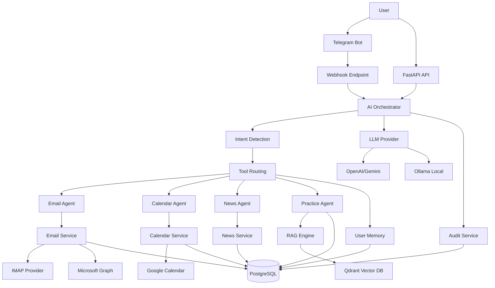

# Personal Academic AI Assistant

A modular AI-powered assistant designed for the academic environment (students and faculty at UNITBV), featuring conversational Telegram interface, email integration, Google Calendar management, structured practice knowledge base, and automated news aggregation.

## Overview

Personal Academic AI Assistant addresses the fragmentation of academic information by centralizing access to multiple communication and information channels: personal and institutional email, Google Calendar, practice documents, deadlines, technology news, and academic updates.

The system implements a modular microservices architecture with a central AI Orchestrator, Retrieval-Augmented Generation (RAG) for document-based responses, and Human-in-the-Loop verification for critical external operations.

### Target Users

- Students managing academic practice requirements, deadlines, and documentation
- Faculty handling practice coordination and student inquiries
- Academic administrators requiring efficient information retrieval and communication

### Key Capabilities

- **Conversational Interface**: Natural language interaction through Telegram with command support and interactive menus
- **Multi-Source Integration**: Unified access to email (personal/UNITBV), Google Calendar, practice documentation, and news feeds
- **Intelligent Routing**: AI-powered intent detection and automated tool selection
- **Document Intelligence**: RAG-based semantic search across academic practice documents with year-based filtering
- **Human-in-the-Loop**: Mandatory confirmation for email sending and calendar modifications
- **Persistent Memory**: Conversation history and user preferences with PostgreSQL backing
- **Automation**: Scheduled workflows for daily briefings, news refresh, deadline reminders, and email polling

## Features

### Core Functionality

- **AI Orchestrator**: Intent detection, tool selection, routing, and multi-agent coordination
- **Telegram Integration**: Webhook-based conversational interface with commands, inline keyboards, and callback queries
- **PostgreSQL Persistence**: 16-table schema for conversations, emails, tasks, memory, audit logs, and practice data
- **User Isolation**: Complete data separation per user across all components
- **RAG Knowledge Base**: Semantic search in practice documents organized by academic years (2024-2025, 2025-2026, 2026-2027)
- **Multi-year Academic Information**: General knowledge structure plus year-specific organization
- **Ollama Integration**: Local LLM runtime with fallback support (nomic-embed-text, qwen2.5:1.5b)
- **Qdrant Vector Database**: Vector embeddings with cosine similarity and metadata filtering
- **Google Calendar Integration**: Event listing, creation, update, deletion with full Human-in-the-Loop
- **Email Workflow**: IMAP provider for personal email with deduplication and classification
- **Microsoft Graph Provider**: UNITBV institutional email integration (implementation complete, access token blocked by external account restrictions)
- **News Agent**: RSS feed fetching, deduplication, relevance scoring for IT and AI topics
- **Action Items/Task Management**: Extraction from email, calendar, and practice with PostgreSQL persistence
- **Daily Briefing**: Automated endpoint with morning synthesis (calendar, email, practice, tasks, news)
- **n8n Automation**: 4 scheduled workflows for briefing, news, deadlines, and email polling
- **Audit Logging**: Automatic sanitization for security-sensitive log entries
- **Backup/Restore**: PostgreSQL dump and Qdrant snapshot with SHA-256 verification
- **Security Hardening**: Rate limiting, HMAC authentication, secrets management

### User Interface Features

- **Interactive Menus**: Persistent 6-button Telegram keyboard for quick access
- **Inline Keyboards**: One-tap actions for email approval, task completion, document generation, calendar confirmation
- **Callback Queries**: Efficient handling of button interactions with proper user attribution
- **Multi-turn Conversations**: Context-aware dialogue with conversation memory
- **Slash Commands**: `/calendar`, `/email`, `/sarcini`, `/stiri`, `/practice`, `/briefing`, `/memorie`
- **Natural Language Queries**: Free-form questions about practice, calendar, tasks, and news

### Administrative Features

- **Health Checks**: `/health`, `/health/live`, `/health/ready`, `/health/dependencies` endpoints
- **Configuration Validation**: Production environment checks on startup
- **Audit Trail**: Comprehensive logging with automatic PII sanitization
- **Rate Limiting**: Token bucket algorithm per user
- **User Allowlist**: Telegram access control via configured user IDs
- **Secret Management**: Environment-based configuration with .env support

## Architecture

The system follows a modular microservices architecture with provider abstraction for external integrations:



### Component Responsibilities

- **Telegram Bot**: User interface with webhook, commands, and interactive keyboards
- **FastAPI API**: API gateway with webhook and automation endpoints
- **AI Orchestrator**: Intent detection, tool registry, routing, context management
- **Agents**: Specialized components for Email, Calendar, News, and Practice operations
- **Services**: Business logic layer (EmailService, CalendarService, NewsService, ActionItemService)
- **PostgreSQL**: Relational database for all persistent data
- **Qdrant**: Vector database for RAG semantic search
- **Ollama**: Local LLM runtime for fallback scenarios
- **n8n**: Automation engine for scheduled workflows

## Technology Stack

| Technology | Version | Purpose |
|-----------|---------|---------|
| Python | 3.14 | Backend language |
| FastAPI | 0.141.1 | API framework |
| Uvicorn | 0.52.4 | ASGI server |
| Pydantic | 2.13.5 | Data validation |
| PostgreSQL | 16 | Relational database |
| SQLAlchemy | 2.0.52 | ORM |
| Alembic | 1.19.1 | Database migrations |
| asyncpg | 0.31.0 | Async PostgreSQL driver |
| Qdrant | 1.19.0 | Vector database |
| Ollama | 0.33.1 | Local LLM runtime |
| OpenAI | 3.6.0 | LLM API client |
| python-telegram-bot | 22.8 | Telegram Bot API |
| google-api-python-client | 2.199.0 | Google Calendar API |
| feedparser | 6.0.14 | RSS feed parsing |
| qdrant-client | 1.19.0 | Qdrant client |
| pytest | 9.1.1 | Testing framework |
| Docker Compose | - | Container orchestration |

## Project Structure

```
ai_assistant_try1/
├── README.md
├── .env.example
├── .gitignore
├── .dockerignore
├── Dockerfile
├── docker-compose.yml
├── pyproject.toml
├── requirements.txt
├── requirements.lock
├── alembic.ini
│
├── automation/
│   └── workflows/
│       ├── daily_briefing.json
│       ├── daily_email_poll.json
│       ├── daily_news_refresh.json
│       └── practice_deadline_reminder.json
│
├── config/
│   ├── news.yaml
│   ├── news.example.yaml
│   ├── practice.yaml
│   └── practice.example.yaml
│
├── scripts/
│   ├── run_automation.py
│   ├── backup.py
│   ├── restore.py
│   ├── retention.py
│   ├── verify_restore.py
│   ├── verify_acceptance.py
│   ├── verify_phase2_persistence.py
│   └── authorize_google_calendar.py
│
├── src/
│   └── app/
│       ├── main.py                 # FastAPI application entry point
│       ├── api/
│       │   ├── dependencies.py     # Dependency injection
│       │   └── routes/
│       │       ├── telegram.py     # Telegram webhook endpoint
│       │       └── automation.py   # Automation endpoints
│       ├── core/
│       │   ├── config.py           # Configuration management
│       │   ├── exceptions.py       # Custom exceptions
│       │   ├── logging.py          # Structured logging
│       │   ├── practice_config.py  # Practice-specific configuration
│       │   ├── rate_limit.py       # Rate limiting implementation
│       │   ├── retry.py            # Retry logic
│       │   └── user_scope.py       # User context management
│       ├── orchestrator/
│       │   ├── orchestrator.py     # Central AI coordinator
│       │   ├── intent.py           # Intent detection
│       │   └── tool_registry.py    # Tool registration
│       ├── agents/
│       │   ├── email_agent.py      # Email operations agent
│       │   ├── calendar_agent.py   # Calendar operations agent
│       │   ├── news_agent.py       # News aggregation agent
│       │   └── practice_agent.py   # Practice knowledge agent
│       ├── llm/
│       │   ├── base.py             # LLM provider interface
│       │   ├── factory.py          # Provider factory
│       │   ├── openai_provider.py  # OpenAI/Gemini implementation
│       │   └── ollama_provider.py  # Ollama implementation
│       ├── integrations/
│       │   ├── telegram/
│       │   │   └── service.py      # Telegram Bot API service
│       │   ├── email/
│       │   │   ├── base.py         # Email provider interface
│       │   │   ├── factory.py      # Email provider factory
│       │   │   ├── imap_provider.py # IMAP implementation
│       │   │   ├── graph_provider.py # Microsoft Graph implementation
│       │   │   ├── unitbv_graph_provider.py # UNITBV-specific Graph
│       │   │   └── mock_provider.py # Mock for testing
│       │   └── google_calendar/
│       │       ├── base.py         # Calendar provider interface
│       │       ├── factory.py      # Calendar provider factory
│       │       ├── google_provider.py # Google Calendar implementation
│       │       └── mock_provider.py # Mock for testing
│       ├── rag/
│       │   ├── chunking.py         # Document chunking
│       │   ├── embeddings.py       # Embedding generation
│       │   ├── vector_store.py     # Qdrant integration
│       │   ├── retrieval.py        # Semantic search
│       │   ├── ingest.py           # Document ingestion
│       │   ├── ingestion.py       # Batch ingestion
│       │   ├── document_registry.py # Document tracking
│       │   └── qa_indexing.py      # Q&A indexing
│       ├── memory/
│       │   ├── conversation_memory.py # Chat history
│       │   └── user_memory.py      # Long-term user preferences
│       ├── database/
│       │   ├── session.py          # Database session management
│       │   └── models/
│       │       └── models.py       # SQLAlchemy models
│       ├── services/
│       │   ├── action_item_service.py    # Task management
│       │   ├── audit_service.py          # Audit logging
│       │   ├── calendar_service.py      # Calendar operations
│       │   ├── calendar_preview.py      # Calendar preview generation
│       │   ├── document_generator_service.py # DOCX generation
│       │   ├── email_service.py          # Email operations
│       │   ├── news_service.py           # News aggregation
│       │   ├── pending_calendar_action_store.py # HITL calendar
│       │   ├── pending_email_draft_store.py     # HITL email
│       │   └── practice_history_service.py     # Practice Q&A
│       └── schemas/
│           ├── calendar.py          # Calendar schemas
│           ├── email.py            # Email schemas
│           ├── news.py             # News schemas
│           ├── rag.py              # RAG schemas
│           └── telegram.py         # Telegram schemas
│
├── database/
│   └── migrations/                 # Alembic migration files
│
├── knowledge_base/
│   ├── general/                   # General practice documents
│   ├── 2024-2025/                 # Academic year 2024-2025
│   ├── 2025-2026/                 # Academic year 2025-2026
│   └── 2026-2027/                 # Academic year 2026-2027
│
├── tests/
│   ├── conftest.py                # Pytest configuration
│   ├── unit/                      # Unit tests
│   └── integration/               # Integration tests
│
├── docs/                          # Additional documentation
├── secrets/                       # OAuth tokens and credentials (gitignored)
└── backups/                       # Backup sets (gitignored)
```

## Database Schema

The application uses PostgreSQL with 16 main tables for comprehensive data persistence:

### Core Tables

- **users**: User accounts with Telegram chat ID mapping
- **academic_years**: Academic year configuration and activation status
- **email_accounts**: Email account configurations (personal/UNITBV)
- **emails**: Email messages with deduplication, classification, and action detection
- **conversations**: Conversation sessions per user
- **conversation_messages**: Individual messages in conversations
- **user_memories**: Long-term user preferences and rules

### Practice-Specific Tables

- **practice_questions**: User questions about practice procedures
- **practice_answers**: AI-generated answers with source attribution
- **practice_documents**: Document registry with checksums and processing status

### Task Management

- **action_items**: Tasks extracted from email, calendar, and practice sources

### Human-in-the-Loop Tables

- **pending_calendar_actions**: Calendar operations awaiting user confirmation
- **pending_email_drafts**: Email drafts awaiting user approval

### News and Audit

- **news_articles**: Aggregated news articles with deduplication and relevance scoring
- **audit_logs**: System activity logs with automatic PII sanitization

### Key Relationships

- All user-scoped tables include `user_id` for data isolation
- Practice tables include `academic_year` for year-based filtering
- Email tables include `account_type` for personal vs. institutional separation
- Pending action tables include TTL-based expiration
- Audit logs include execution duration and external operation tracking

## AI and RAG Architecture

### Intent Detection Pipeline

1. **Input Processing**: User message normalization and context extraction
2. **Pattern Matching**: Direct command/button mapping for high-confidence intents
3. **Keyword Analysis**: Domain-specific keyword detection (practice, email, calendar, news)
4. **Context Analysis**: Conversation history evaluation for follow-up queries
5. **LLM Fallback**: OpenAI/Ollama-based intent classification for ambiguous queries

### Tool Routing

The orchestrator maintains a tool registry with the following registered tools:

- `tasks_list`: List open tasks and action items
- `tasks_create`: Create new tasks
- `email_search`: Search and list emails
- `email_draft_reply`: Generate email draft responses
- `email_send`: Send approved emails
- `calendar_search`: Fetch calendar events
- `news_search`: Fetch news articles by topic
- `practice_search`: Query practice knowledge base
- `memory_save`: Store user preferences
- `memory_list`: Retrieve user preferences

### RAG Pipeline

**Ingestion Process**:
1. Document discovery from `knowledge_base/` directory structure
2. Text extraction from PDF, TXT, MD files
3. SHA-256 checksum calculation for deduplication
4. Text cleaning and normalization
5. Chunking (800 tokens, 100 overlap)
6. Embedding generation (OpenAI or Ollama)
7. Qdrant vector storage with metadata

**Retrieval Process**:
1. User query embedding generation
2. Qdrant semantic search with filters:
   - `academic_year`: Year-specific or general
   - `user_id`: User-specific or global documents
   - Score threshold: 0.35
3. Top-K retrieval (default: 5)
4. Source attribution and citation
5. Grounded answer generation with LLM

**Document Metadata**:
- `chunk_id`: Unique chunk identifier
- `document_id`: Source document identifier
- `academic_year`: Year classification
- `user_id`: Owner (null = global)
- `document_type`: Category (rules, template, etc.)
- `source_path`: Original file path
- `checksum`: Document integrity verification

### LLM Providers

**OpenAI/Gemini**:
- Primary provider for production
- Models: gpt-4o-mini (default), text-embedding-3-small
- Configurable via `OPENAI_API_KEY` and `OPENAI_BASE_URL`

**Ollama**:
- Local fallback provider
- Models: qwen2.5:1.5b (chat), nomic-embed-text (embeddings)
- Configured via `OLLAMA_BASE_URL`
- Requires Docker container startup and model initialization

## Telegram Integration

### Webhook Configuration

- **Endpoint**: `/api/v1/telegram/webhook`
- **Authentication**: HMAC verification using `TELEGRAM_WEBHOOK_SECRET`
- **Security**: User allowlist via `TELEGRAM_ALLOWED_USER_IDS`
- **Rate Limiting**: Token bucket algorithm (configurable requests/window)

### Commands

- `/start` - Welcome message and main menu
- `/help` - Help information
- `/calendar` - Calendar query interface
- `/email` - Email checking and drafting
- `/sarcini` - Task listing and management
- `/stiri` - News aggregation
- `/practice` - Practice knowledge base queries
- `/documente` - Document generation interface
- `/briefing` - Daily briefing synthesis
- `/sinteza` - Aggregated overview
- `/memorie` - User preference management

### Interactive Features

**Main Menu Keyboard**:
- 6-button persistent keyboard for quick access
- Convenție Practică, Caiet de Practică
- Sarcinile Mele, Program Calendar
- Verifică Emailuri, Știri Tehnologice

**Inline Keyboards**:
- Email draft approval (Send/Cancel)
- Task completion (one-tap finalization)
- Document generation (Convenție/Caiet/Both)
- Calendar actions (Confirm/Cancel)
- Email quick reply (per-email buttons)

### Human-in-the-Loop

**Email Workflow**:
1. User requests reply to email
2. System generates draft with LLM
3. Draft stored in `pending_email_drafts` with TTL
4. Inline keyboard presented for approval
5. User confirms or cancels
6. Email sent via SMTP only after confirmation

**Calendar Workflow**:
1. User requests calendar modification (create/update/delete)
2. System generates preview with details
3. Action stored in `pending_calendar_actions` with TTL
4. Inline keyboard presented for confirmation
5. User confirms or cancels
6. Google Calendar API called only after confirmation

### Multi-turn Conversations

- Conversation history maintained in PostgreSQL
- Last 8 messages provided as context
- Session-based organization per chat
- User-scoped memory for context isolation

## News Agent

### Configuration

Located in `config/news.yaml`:

```yaml
news:
  enabled: true
  schedule_cron: "0 8 * * *"  # Daily at 08:00 AM
  relevance_threshold: 70     # Score 0-100
  max_results: 5

  topics:
    - name: AI
      keywords: [OpenAI, Gemini, LLM, Claude, RAG, Agent, GPT]
    - name: Embedded
      keywords: [NXP, RW612, MCUXpresso, Microcontroller, ARM Cortex]
    - name: University
      keywords: [UNITBV, Universitatea Transilvania, practica studenteasca]
    - name: Programming
      keywords: [Python, FastAPI, Docker, PostgreSQL, React]

  sources:
    - name: TechCrunch AI
      url: https://techcrunch.com/category/artificial-intelligence/feed/
      type: rss
    - name: Hacker News RSS
      url: https://news.ycombinator.com/rss
      type: rss
    - name: UNITBV News Feed
      url: https://www.unitbv.ro/stiri-si-evenimente?format=feed&type=rss
      type: rss
```

### Processing Pipeline

1. RSS feed fetching at scheduled intervals
2. Article deduplication via SHA-256 fingerprinting
3. Keyword-based relevance scoring
4. Topic classification
5. PostgreSQL persistence with user isolation
6. LLM-based summarization (optional)

### Automation Integration

- **Workflow**: `daily_news_refresh.json`
- **Trigger**: Cron daily 08:00 AM
- **Endpoint**: `/api/v1/automation/news/refresh`
- **Authentication**: `X-Automation-Key` header with HMAC verification

## Configuration

### Environment Variables

Copy `.env.example` to `.env` and configure the following:

#### Application Settings

```bash
APP_ENV=development                    # development | production
LOG_LEVEL=INFO
SECRET_KEY=your-secret-key-here
HOST=0.0.0.0
PORT=8000
CURRENT_ACADEMIC_YEAR=2026-2027
ALLOW_MOCK_PROVIDERS=true             # Enable mock providers in development
CORS_ALLOWED_ORIGINS=                 # Comma-separated URLs for production
```

#### PostgreSQL

```bash
POSTGRES_USER=postgres
POSTGRES_PASSWORD=your-secure-password
POSTGRES_DB=academic_assistant_db
POSTGRES_HOST=localhost               # postgres in Docker
POSTGRES_PORT=5432
DATABASE_CONNECT_TIMEOUT_SECONDS=2
SQL_ECHO=false
```

#### Qdrant

```bash
QDRANT_HOST=localhost                 # qdrant in Docker
QDRANT_PORT=6333
QDRANT_COLLECTION=practice_knowledge
QDRANT_API_KEY=your-qdrant-api-key
```

#### LLM Providers

```bash
LLM_PROVIDER=openai                   # openai | ollama
DEFAULT_MODEL=gpt-4o-mini
OPENAI_API_KEY=your-openai-api-key
OPENAI_BASE_URL=                      # Optional: custom OpenAI endpoint

EMBEDDING_PROVIDER=openai             # openai | ollama
EMBEDDING_MODEL=text-embedding-3-small
EMBEDDING_VECTOR_SIZE=1536

OLLAMA_BASE_URL=http://localhost:11434  # ollama in Docker
OLLAMA_MODEL=llama3.2
OLLAMA_REQUEST_TIMEOUT_SECONDS=120.0
```

#### Telegram

```bash
TELEGRAM_BOT_TOKEN=your-telegram-bot-token
TELEGRAM_WEBHOOK_SECRET=your-webhook-secret
TELEGRAM_WEBHOOK_URL=https://your-domain.com/api/v1/telegram/webhook
TELEGRAM_ALLOWED_USER_IDS=123456789,987654321
```

#### Email Integration

```bash
# Personal Email (IMAP)
EMAIL_PROVIDER=imap
EMAIL_ACCOUNT=your-email@gmail.com
EMAIL_PASSWORD=your-app-password
EMAIL_IMAP_SERVER=imap.gmail.com
EMAIL_IMAP_PORT=993
EMAIL_IMAP_FOLDER=INBOX
EMAIL_IMAP_USE_SSL=true
EMAIL_SMTP_SERVER=smtp.gmail.com
EMAIL_SMTP_PORT=587
EMAIL_SMTP_USE_STARTTLS=true

# UNITBV Email (Microsoft Graph)
UNITBV_EMAIL_PROVIDER=graph
UNITBV_EMAIL_ACCOUNT=your-unitbv-email@unitbv.ro
MICROSOFT_TENANT_ID=your-tenant-id
MICROSOFT_CLIENT_ID=your-client-id
MICROSOFT_CLIENT_SECRET=your-client-secret
MICROSOFT_MAILBOX_ADDRESS=your-unitbv-email@unitbv.ro
```

#### Google Calendar

```bash
CALENDAR_PROVIDER=google
GOOGLE_AUTH_MODE=oauth                 # oauth | service_account
GOOGLE_CLIENT_ID=your-client-id
GOOGLE_CLIENT_SECRET=your-client-secret
GOOGLE_REDIRECT_URI=http://localhost:8000/api/v1/auth/google/callback
GOOGLE_TOKEN_FILE=secrets/google-calendar-token.json
GOOGLE_CALENDAR_ID=primary
GOOGLE_CALENDAR_TIMEZONE=Europe/Bucharest
```

#### News and Automation

```bash
NEWS_CONFIG_FILE=config/news.example.yaml
NEWS_MAX_RESULTS=5
N8N_HOST=localhost
N8N_PORT=5678
AUTOMATION_API_KEY=your-automation-api-key
```

#### Security and Rate Limiting

```bash
REQUIRE_HUMAN_APPROVAL_FOR_EMAILS=true
REQUIRE_HUMAN_APPROVAL_FOR_CALENDAR_MODS=true
DRAFT_APPROVAL_TTL_SECONDS=900
CALENDAR_ACTION_TTL_SECONDS=900
EXTERNAL_RETRY_ATTEMPTS=2
EXTERNAL_REQUEST_TIMEOUT_SECONDS=20
AUDIT_LOG_ENABLED=true
AUDIT_LOG_STORE_REQUEST_CONTENT=false
RATE_LIMIT_ENABLED=true
RATE_LIMIT_WINDOW_SECONDS=60
TELEGRAM_RATE_LIMIT_REQUESTS=30
RATE_LIMIT_MAX_TRACKED_KEYS=10000
```

#### Backup and Restore

```bash
BACKUP_DIR=backups
BACKUP_RETENTION_DAYS=7
```

## Installation and Setup

### Prerequisites

- Docker Desktop and Docker Compose
- Git
- Python 3.14+ (for local development)

### 1. Clone Repository

```bash
git clone <repository-url>
cd ai_assistant_try1
```

### 2. Configure Environment

```bash
cp .env.example .env
# Edit .env with your configuration values
```

### 3. Start Infrastructure Services

```bash
docker compose up -d postgres qdrant n8n ollama
```

This starts:
- PostgreSQL 16 on port 5432
- Qdrant 1.19.0 on port 6333
- n8n 2.37.4 on port 5678
- Ollama 0.33.1 on port 11435

### 4. Initialize Ollama Models

The `ollama-init` service automatically downloads required models:

```bash
# Models are pulled automatically during container startup
# Default models: qwen2.5:1.5b (chat), nomic-embed-text (embeddings)
```

### 5. Run Database Migrations

```bash
docker compose --profile tools run --rm migrate
```

### 6. Start Application

```bash
docker compose up -d --build app
```

The application will be available at `http://localhost:8000`

### 7. Ingest RAG Documents

```bash
docker compose exec app python -m src.app.rag.ingest
```

This processes documents from `knowledge_base/` into Qdrant.

### 8. Configure Telegram Webhook (Production)

```bash
curl -X POST "http://localhost:8000/api/v1/telegram/setup-webhook" \
  -H "Content-Type: application/json" \
  -H "X-Telegram-Bot-Api-Secret-Token: your-webhook-secret" \
  -d '{"webhook_url": "https://your-domain.com/api/v1/telegram/webhook"}'
```

### 9. Authorize Google Calendar (Optional)

```bash
python scripts/authorize_google_calendar.py
```

Follow the OAuth flow to authorize the application.

## Docker Services

### Service Overview

| Service | Image | Ports | Purpose |
|---------|-------|-------|---------|
| app | python:3.14-slim | 8000 | FastAPI application |
| postgres | postgres:16-alpine | 5432 | Relational database |
| qdrant | qdrant/qdrant:v1.19.0 | 6333, 6334 | Vector database |
| n8n | n8nio/n8n:2.37.4 | 5678 | Automation engine |
| ollama | ollama/ollama:0.33.1 | 11435 | Local LLM runtime |
| ollama-init | ollama/ollama:0.33.1 | - | Model initialization |
| migrate | python:3.14-slim | - | Database migrations |

### Common Commands

```bash
# Start all services
docker compose up -d

# Start with rebuild
docker compose up -d --build

# Stop all services
docker compose down

# View logs
docker compose logs -f app

# Restart specific service
docker compose restart app

# Run migrations
docker compose --profile tools run --rm migrate

# Execute command in app container
docker compose exec app python -m src.app.rag.ingest

# Clean up volumes (WARNING: deletes data)
docker compose down -v
```

## API Endpoints

### Health Endpoints

- `GET /` - Application information
- `GET /health` - Basic health check
- `GET /health/live` - Liveness probe (container health)
- `GET /health/ready` - Readiness probe (dependency checks)
- `GET /health/dependencies` - Configuration and integration status

### Telegram Endpoints

- `POST /api/v1/telegram/webhook` - Telegram webhook endpoint
- `POST /api/v1/telegram/setup-webhook` - Configure Telegram webhook

### Automation Endpoints

- `POST /api/v1/automation/daily-briefing` - Generate daily briefing
- `POST /api/v1/automation/news/refresh` - Refresh news articles
- `POST /api/v1/automation/practice/deadlines-check` - Check practice deadlines
- `POST /api/v1/automation/email/poll` - Poll for new emails

### Authentication

- **Telegram Webhook**: HMAC verification via `X-Telegram-Bot-Api-Secret-Token` header
- **Automation**: HMAC verification via `X-Automation-Key` header
- **User Authorization**: Telegram user ID allowlist

## Testing

### Test Suite Overview

The project includes 244 tests covering unit and integration scenarios:

- **Unit Tests**: 200+ tests for individual components
- **Integration Tests**: 40+ tests for end-to-end workflows
- **Live Tests**: Tests requiring actual services (marked with appropriate markers)

### Running Tests

```bash
# Run all tests
docker compose exec app pytest -v

# Run with coverage
docker compose exec app pytest --cov=src --cov-report=html

# Run only unit tests
docker compose exec app pytest tests/unit/

# Run only integration tests
docker compose exec app pytest tests/integration/

# Run specific test file
docker compose exec app pytest tests/unit/test_orchestrator.py

# Run with markers
docker compose exec app pytest -m "not integration"
```

### Test Categories

**Unit Tests**:
- Agent logic (email, calendar, news, practice)
- LLM providers (OpenAI, Ollama)
- RAG components (chunking, embeddings, retrieval)
- Services (action items, audit, document generation)
- Configuration validation
- Production guards
- User isolation
- Rate limiting
- Memory management

**Integration Tests**:
- Telegram webhook flow
- Calendar HITL workflows
- Email HITL workflows
- M3-M6 workflow scenarios
- Live RAG with Qdrant
- Live Ollama integration
- Backup/restore isolation

### Skipped Tests

Some tests are skipped when required conditions are not met:
- `RUN_LIVE_RAG=false`: Live RAG tests skipped
- External service unavailability: Integration tests skipped
- Missing configurations: Provider-specific tests skipped

Skipped tests are NOT failures - they are conditional executions.

## Security

### Authentication and Authorization

- **Telegram Webhook**: HMAC verification using shared secret
- **Automation API**: HMAC verification using automation key
- **User Allowlist**: Telegram user ID whitelist
- **Production Validation**: Startup checks for placeholder secrets

### Data Protection

- **User Isolation**: All data scoped by `user_id`
- **Audit Sanitization**: Automatic PII redaction (email, phone, tokens)
- **Secrets Management**: Environment variables, .env excluded from git
- **Rate Limiting**: Per-user request throttling
- **Input Validation**: Pydantic schema validation

### Human-in-the-Loop

- **Email Sending**: Mandatory draft approval before sending
- **Calendar Modifications**: Mandatory confirmation before API calls
- **TTL Expiration**: Pending actions expire after configurable time
- **Cross-User Protection**: Users cannot approve other users' actions

### Network Security

- **CORS Configuration**: Explicit origin allowlist in production
- **Webhook Security**: HTTPS requirement for production webhooks
- **Container Security**: Non-root user, minimal attack surface
- **Dependency Pinning**: Specific digest hashes for Docker images

## Backup and Restore

### Backup Process

```bash
# Create backup set
python scripts/backup.py

# Output: backups/<timestamp>/
#   - postgres_dump.dump (PostgreSQL custom format)
#   - qdrant_snapshot/ (Qdrant snapshot)
#   - manifest.json (SHA-256 checksums)
```

### Restore Process

```bash
# Restore from specific timestamp
python scripts/restore.py <timestamp>

# Verification in isolated containers
python scripts/verify_restore.py <timestamp>
```

### Retention Policy

```bash
# Clean up old backups (dry run)
python scripts/retention.py --dry-run

# Actually delete expired backups
python scripts/retention.py
```

### Integrity Verification

- SHA-256 checksums for all backup files
- PostgreSQL dump format validation
- Qdrant snapshot verification
- Isolated container testing before production restore

**Note**: Production restore has not been live-verified. Scripts are functional but production restore is untested.

## Project Status

### Implemented Features

- **Core Architecture**: Modular microservices with AI Orchestrator
- **Telegram Integration**: Full webhook implementation with interactive UI
- **Database Persistence**: 16-table PostgreSQL schema with relationships
- **RAG System**: Document ingestion, embedding, semantic search with Qdrant
- **Email Integration**: IMAP provider with draft generation and HITL
- **Calendar Integration**: Google Calendar with full CRUD and HITL
- **News Agent**: RSS aggregation with deduplication and scoring
- **Task Management**: Action items with multi-source extraction
- **Memory System**: Conversation history and user preferences
- **Audit Logging**: Comprehensive logging with sanitization
- **Security**: Rate limiting, authentication, user isolation
- **Automation**: n8n workflows for scheduled operations
- **Backup/Restore**: PostgreSQL and Qdrant backup with verification
- **Testing**: 244 tests with good coverage

### Deferred/Blocked Features

- **UNITBV Microsoft Graph**: Provider fully implemented but access token blocked by external Microsoft/UNITBV account restrictions. This is an external limitation, not an implementation issue.

### Known Limitations

1. **Production Restore**: Not live-verified (scripts exist and are functional)
2. **Single-threaded Ollama**: Not parallelized (acceptable for current scale)
3. **Qdrant Mock Fallback**: Development-only, not for production
4. **No Web UI**: Telegram is the primary interface
5. **Skipped Tests**: 10+ tests skipped when live conditions unavailable

## Roadmap

### Short-term Improvements

- Stabilize external integrations (Google Calendar OAuth flow)
- Production restore verification
- Enhanced error handling and user feedback
- Additional test coverage for edge cases

### Medium-term Enhancements

- Web UI for administrative functions
- Enhanced observability (metrics, tracing)
- CI/CD pipeline setup
- Security hardening review
- Performance optimization

### Long-term Vision

- Multi-language support
- Additional academic institutions
- Advanced document processing (OCR, tables)
- Mobile application
- Federation across multiple instances

## Documentation

### Technical Documentation

Comprehensive technical documentation is available in:
- `Personal_Academic_AI_Assistant_Documentatie_Finala_Professional.docx`

This document includes:
- Detailed architecture description
- Technology stack analysis
- Implementation details
- Testing and verification procedures
- Deployment guide
- Configuration reference
- API endpoint documentation
- n8n workflow specifications
- Test matrix
- Glossary

### Configuration Guides

- `UNITBV_OAUTH2_SETUP.md` - Microsoft Graph OAuth setup instructions
- `config/news.example.yaml` - News agent configuration template
- `config/practice.example.yaml` - Practice configuration template

## Development

### Local Development Setup

```bash
# Create virtual environment
python -m venv .venv
source .venv/bin/activate  # On Windows: .venv\Scripts\activate

# Install dependencies
pip install -r requirements.txt

# Set environment variables
cp .env.example .env
# Edit .env with local configuration

# Run database migrations
alembic upgrade head

# Start application (local)
uvicorn src.app.main:app --reload --host 0.0.0.0 --port 8000

# Run tests
pytest -v
```

### Code Style

- Follow PEP 8 guidelines
- Use type hints where appropriate
- Write docstrings for functions and classes
- Keep functions focused and modular
- Use dependency injection for testability

### Adding New Features

1. Implement core logic in appropriate agent/service
2. Add database models if persistence needed
3. Register tools in orchestrator if AI-accessible
4. Add unit tests for new functionality
5. Add integration tests for workflows
6. Update configuration if new variables needed
7. Update documentation

## Troubleshooting

### Common Issues

**Telegram Webhook Not Working**:
- Verify `TELEGRAM_WEBHOOK_SECRET` matches header
- Check webhook URL is public HTTPS
- Ensure bot token is valid
- Check user ID is in allowlist

**Qdrant Connection Failed**:
- Verify Qdrant container is running: `docker compose ps qdrant`
- Check `QDRANT_HOST` and `QDRANT_PORT` configuration
- Verify API key if configured

**Ollama Models Not Available**:
- Check Ollama container health: `docker compose ps ollama`
- Verify model pull completed: `docker compose logs ollama-init`
- Check `OLLAMA_BASE_URL` configuration

**Database Connection Issues**:
- Verify PostgreSQL container is running
- Check database credentials in `.env`
- Ensure migrations have been run
- Verify database exists

**Tests Failing**:
- Check all required services are running
- Verify environment configuration
- Run with `-v` flag for detailed output
- Check for skipped tests and conditions

## License

This is an academic project developed for student practice at UNITBV (Universitatea Transilvania din Brașov).

## Contributing

This is an academic project. For questions or suggestions, please contact the development team.

## Acknowledgments

- Universitatea Transilvania din Brașov - Academic context and requirements
- UNITBV FIESC - Faculty support and practice coordination
- OpenAI, Ollama, Qdrant - AI/ML infrastructure providers
- Telegram - Bot API and platform
- FastAPI, SQLAlchemy, PostgreSQL - Core technology stack
